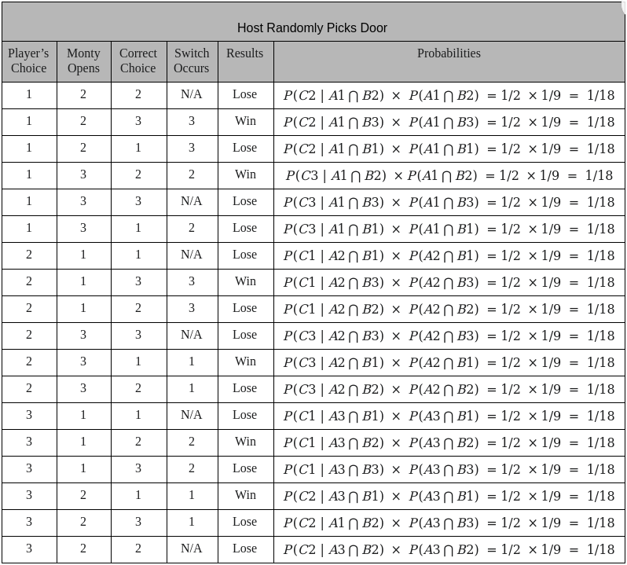

# Monty Hall Problem

## Contents
- [Description](https://github.com/maknop/monty-hall-problem/blob/main/README.md#description)
- [Assumptions](https://github.com/maknop/monty-hall-problem/blob/main/README.md#assumptions)  
    - [Player Switches Doors](https://github.com/maknop/monty-hall-problem/blob/main/README.md#player-switches-doors)  
    - [Player Does Not Switch Doors](https://github.com/maknop/monty-hall-problem/blob/main/README.md#player-does-not-switch-doors)  
    - [Host Randomly Picks Door](https://github.com/maknop/monty-hall-problem/blob/main/README.md#host-randomly-picks-door)  
- [Run Experiment](https://github.com/maknop/monty-hall-problem/blob/main/README.md#run-experiment)
    - [Installation](https://github.com/maknop/monty-hall-problem/blob/main/README.md#installation)
    - [Running Program](https://github.com/maknop/monty-hall-problem/blob/main/README.md#running-program)
- [Conclusion](https://github.com/maknop/monty-hall-problem/blob/main/README.md#conclusion)

## Description
The Monty Hall problem involves the idea that you’re essentially in a game show and you, which will  
be referred to as the player, have three doors to choose from. Behind each of those doors lies one  
of two goats or a brand-new car. Your host, named Monty Hall, tells you to choose a door. Once you  
have chosen one of the doors, Monty then has one of the other doors that does contain one of the goats  
opened. Following this, he gives you the option to either keep your current pick or change to the other  
door not opened. It is assumed here that the player’s goal is to win the car in particular.  There are  
several assumptions made in the Monty Hall problem, such as:
1. Once you have chosen a door, Monty will always open one with a goat behind it. 
2. The door Monty opens will not be the one you chose and does not contain the car. 
3. There is an equal chance of the car being behind any of the doors. 

## Various Assumptions

### Player Switches Doors
A = Picking one of three doors = 1/3  
B = Car is behind chosen door = 1/3  
C = Monty’s choice of doors to invalidate = 1/2  


```
S = { ( 1, 3, 1 ), ( 1, 3, 2 ), ( 1, 2, 1 ), ( 1, 2, 3 ),  
      ( 2, 3, 1 ), ( 2, 3, 2 ), ( 2, 1, 3 ), ( 2, 3, 2 ),  
      ( 3, 2, 1 ), ( 3, 2, 3 ), ( 3, 1, 3 ), ( 3, 1, 2 ) } = 12 total outcomes  

W = { ( 1, 3, 2 ), ( 1, 2, 3 ), ( 2, 3, 1 ),  
      ( 2, 1, 3 ), ( 3, 2, 1 ), ( 3, 1, 2 )  } = 6 outcomes  
```

Therefore, `P(W) = 1/9 + 1/9 + 1/9 + 1/9 + 1/9 + 1/9 = 6/9`  

### Player Does Not Switch Doors
A = Picking one of three doors = 1/3  
B = Car is behind chosen door = 1/3  
C = Monty’s choice of doors to invalidate = 1/2  


```
S = { ( 1, 3, 1 ), ( 1, 3, 2 ), ( 1, 2, 1 ), ( 1, 2, 3 ),  
      ( 2, 3, 1 ), ( 2, 3, 2 ), ( 2, 1, 3 ), ( 2, 3, 2 ),  
      ( 3, 2, 1 ), ( 3, 2, 3 ), ( 3, 1, 3 ), ( 3, 1, 2 ) } = 12 total outcomes  

W = { (1, 3, 1), (1, 2, 1), (2, 3, 2),  
      (2, 1, 2), (3, 2, 3), (3, 1, 3) } = 6 outcomes  
```

Therefore, `P(W) = 1/18 + 1/18 + 1/18 + 1/18 + 1/18 + 1/18 = 6/18 = 1/3`

### Host Randomly Picks Door
A = Picking one of three doors = 1/3
B = Car is behind chosen door = 1/3
C = Monty’s choice of doors to invalidate = 1/2



```
S = { (1, 2, 2), (1, 2, 3), (1, 2, 1), (1, 3, 2), (1, 3, 3), (1, 3, 1),  
      (2, 1, 1), (2, 1, 3), (2, 1, 2), (2, 3, 3), (2, 3, 1), (2, 3, 2),  
      (3, 1, 1), (3, 1, 2), (3, 1, 3), (3, 2, 1), (3, 2, 3), (3, 2, 2) } = 18 total outcomes  
  
W = { (1, 2, 3), (1, 3, 2), (2, 1, 3),  
      (2, 3, 1), (3, 1, 2), (3, 2, 1) } = 6 total outcomes
```

Therefore, `P(W) = 1/18 + 1/18 + 1/18 + 1/18 + 1/18 + 1/18 = 6/18 = 1/3`

## Run Experiment
### Installation
```
make init
```

### Running Program
```
make run
```
OR
```
sh start.sh
```

## Conclusion
If we compare two different situations, one where Monty knows which door has the car behind it and  
the other where Monty does not know, and where the player swaps doors every time for both of these,  
we see distinct differences in results. According to our results in both situations, one bears a  
greater probability of success for the player. If Monty is totally aware of which door contains the  
car the player has a greater chance of succeeding since they aren’t playing against Monty who could  
actually reveal the door that contains the car. The situation where Monty is not aware of which door  
has the car behind it adds six outcomes all where Monty opens a door and reveals the car. Therefore,  
this discussion of whether or not Monty knows which door contains the car is important because of the  
difference in outcomes. Additionally, when looking at the actual probabilities, for every situation we  
must consider the fact that Monty did not open the door with the car. This differs from the situation  
where Monty does know which door contains the car and avoids opening it. Since people are skeptical  
overall of how the probability is known to be higher when the player switches doors, it is important  
to note that this does not work when Monty Hall does not know which door contains the car. As stated  
above, this adds six more outcomes that result in a higher chance of losing than actually winning.  
Based on our analysis, it shows that the probability is higher when the player switches doors which is  
inaccurate when assuming Monty does not know which door has the car. 
